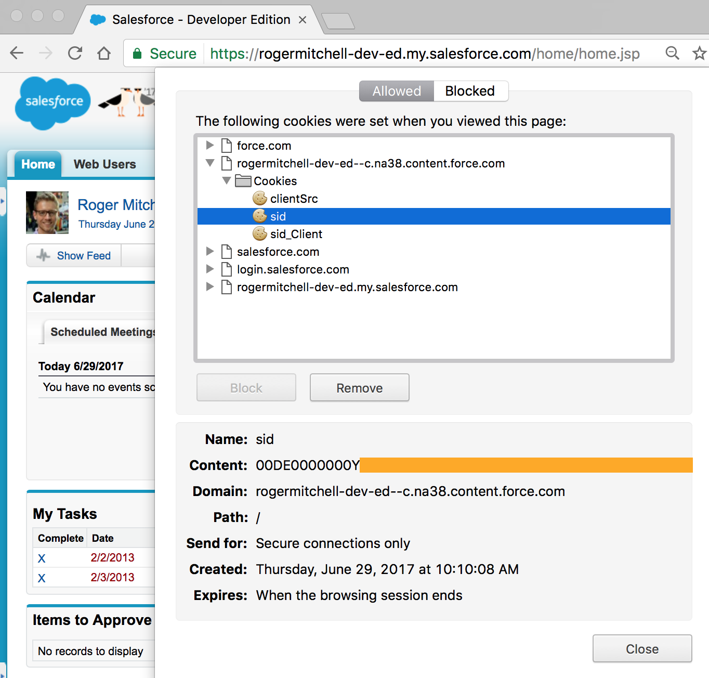
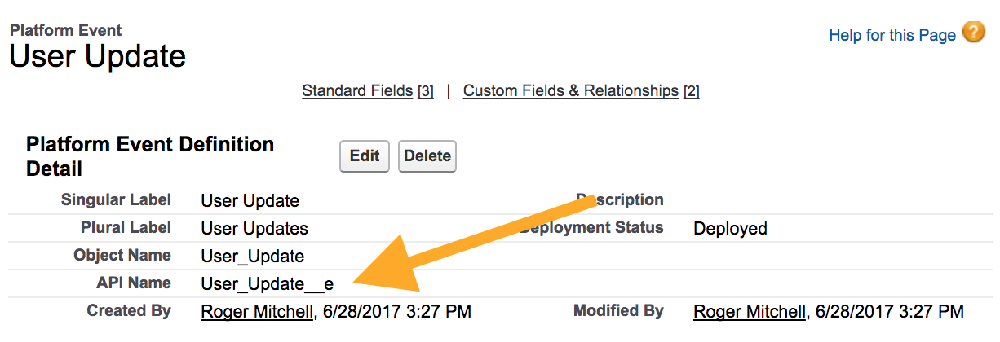

## Subscribing to Platform Events with NodeJS

Here's a quick proof of concept that shows how to subscribe to Platform Events. There are a few changes that you'd like to make prior to setting up and testing out your subscription.

### Setup Steps

1. Log into your Salesforce org within the browser
1. Update `baseUrl` in **app.js** to be your base instance URL appended with "/cometd/40.0"
1. Inspect the cookies for this site in your browser, and copy the value from the `sid` cookie; you'll set this as the value of `token` in **app.js**

1. Navigate to your Platform Event in the Setup UI and copy the API name; you'll set this as the value of `platformEventName` in **app.js**

### Running the App

To ensure we have the appropriate node packages installed, navigate to this project's directory and run `npm install`. Upon finishing the installation of **cometd** and **cometd-nodejs-client**.

When this finishes, run `node app.js` to subscribe to the platform event. If there are any errors, these will be dumped into the terminal output, otherwise terminal should display nothing until an event is created.

Create a platform event using process builder, Apex, or the API and observe the output in the terminal.